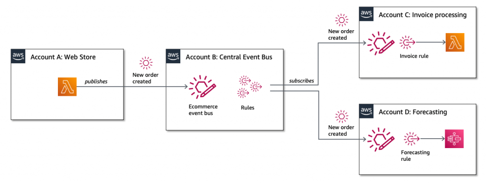
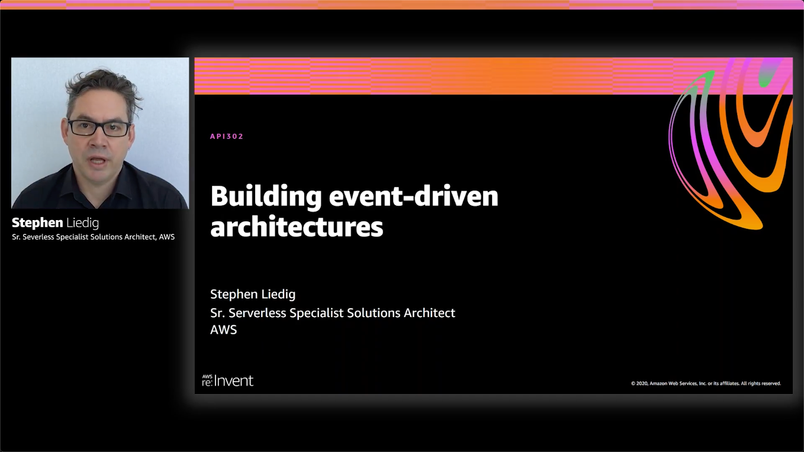

# Amazon EventBridge resource policy samples

[Amazon EventBridge](https://aws.amazon.com/eventbridge) resource policies that make it easier to build applications that work across accounts. Resource policies provide you with a powerful mechanism for modeling your event buses across multiple accounts, and give you fine-grained control over EventBridge API invocations.

This repository contains sample implementations for Amazon EventBridge resource policies.

## [1. E-commerce example walk-through](blog/BLOG.md)

This sample application walks you through how to use Amazon EventBridge resource policies as presented in [feature release blog post](https://aws.amazon.com/blogs/compute/simplifying-cross-account-access-with-amazon-eventbridge-resource-policies)

Get started with the [**e-commerce sample >**](blog/BLOG.md)

## [2. Multi-account design patterns](patterns/PATTERNS.md)

The samples in this section provide sample implementations using **"single-bus, multi-account"**, and **"multi-bus, multi-account"** patterns as presented in the AWS re:Invent 2020 session [Building event-driven applications with Amazon EventBridge](https://virtual.awsevents.com/media/t/1_ynykxz80/186983983) which is available on demand.

Get started with the [**multi-account design patterns >**](patterns/PATTERNS.md)

---

For more serverless learning resources, visit [Serverless Land](https://serverlessland.com/).

## Security

See [CONTRIBUTING](CONTRIBUTING.md#security-issue-notifications) for more information.

## License

This library is licensed under the MIT-0 License. See the LICENSE file.

Copyright 2020 Amazon.com, Inc. or its affiliates. All Rights Reserved.

SPDX-License-Identifier: MIT-0