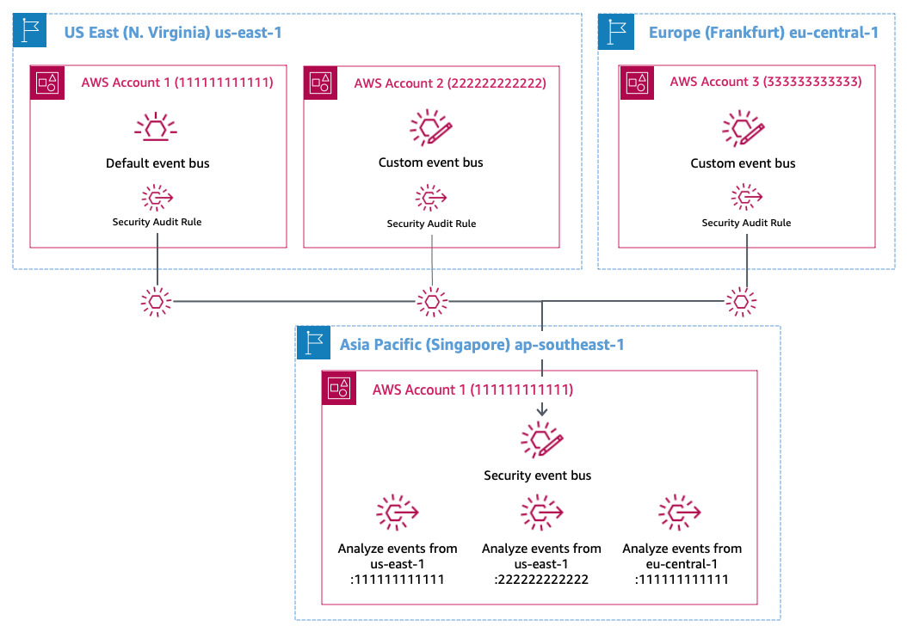

# Cross-Region event delivery sample



## Setup

This sample uses the Serverless Application Model Command Line Interface (SAM CLI). To use the SAM CLI, you need the following tools.

* SAM CLI - [Install the SAM CLI](https://docs.aws.amazon.com/serverless-application-model/latest/developerguide/serverless-sam-cli-install.html)
* [Python 3 installed](https://www.python.org/downloads/)
* Docker - [Install Docker community edition](https://hub.docker.com/search/?type=edition&offering=community)

To run this demo in your own accounts, you need to have access to three accounts. The account numbers map to:

* account_1 -> your first account number (used for the security event bus in region ap-southeast-1, and the default event bus in region us-east-1)
* account_2 -> your second account number (used for the custom event bus in account 2)
* account_3 -> your thirst account number (used for the custom event bus in account 3)

Create AWS CLI Profiles for these accounts. For information on how to create named profiles visit <https://docs.aws.amazon.com/cli/latest/userguide/cli-configure-profiles.html>

Once you have the profiles created open the `Makefile` and replace the variables at the top of the file with your profile names

```Makefile
# Add your profile names here
PROFILE1        := "profile_for_account_1"
PROFILE2       	:= "profile_for_account_2"
PROFILE3       	:= "profile_for_account_3"
```

Optionally you can pass these as paramaters as required.

## Deploy source accounts

```bash
make deploy-source SECURITY_ACCOUNT_NO=[account number mapped to account_1]
```

Get the ARN numbers of the event buses that were just created, including the default event bus for Account 1.

### Deploy security event bus

```bash
make deploy-security-bus PROFILE1="profile_for_account_1"
```

Deploy the rules

```bash
make deploy-rules PROFILE1=[profile_for_account_1] PROFILE3=[profile_for_account_3] SECURITYEVENTBUSARN=[ARN] EVENTBUSARNACCOUNT1=[ARN] EVENTBUSARNACCOUNT2=[ARN] EVENTBUSARNACCOUNT3=[ARN]
```
