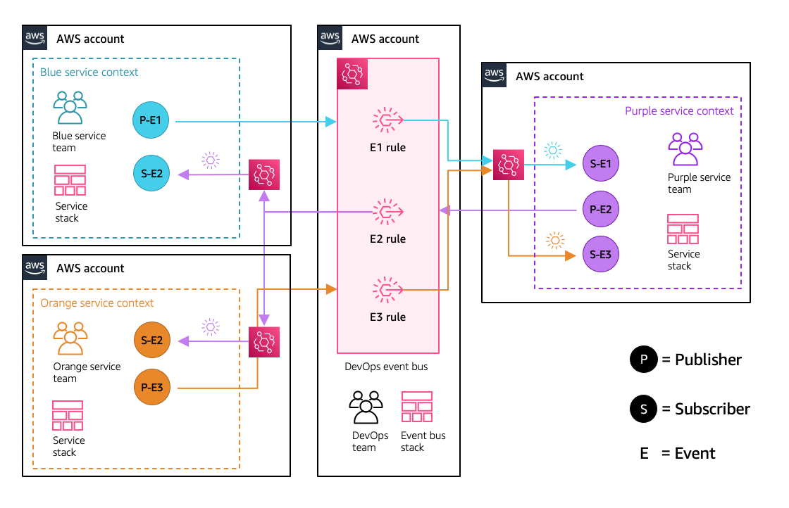

# Single-bus, multi-account pattern



## Characteristics

- Introduces the need for multiple event buses to transfer event between accounts
- Routing rules still via central bus
- Target rules migrate to service account event bus

### Team

- Service teams manage target configurations, but not routings

### Considerations

- Additional cross-account policy management (compared to single-bus, single account pattern)

## Installation Instructions

### Requirements

1. To run these samples in your own accounts you need to have the following tooling:

    - AWS CLI already configured with Administrator permission
    - [AWS SAM CLI installed](https://docs.aws.amazon.com/serverless-application-model/latest/developerguide/serverless-sam-cli-install.html)

2. [Create 4 AWS accounts](https://portal.aws.amazon.com/gp/aws/developer/registration/index.html) if you do not already have them and login

3. Clone this repo onto your local development machine:

``` bash
git clone https://github.com/aws-samples/amazon-eventbridge-resource-policy-samples
```

### Getting started

1. Make sure you have a reference to all the account number where you are going to deploy each of the service resources.
1. Navigate to the `patterns/single-bus-multi-account-pattern` directory. There you will find the projects for each of the services and devops account.

    ``` bash
    .
    ├── README.md
    ├── blue-service-account
    │   └── blue-service-app
    │       └── template.yaml
    ├── devops-account
    │   └── template.yaml
    ├── orange-service-account
    │   └── orange-service-app
    │       └── template.yaml
    └── purple-service-account
        └── purple-service-app
            └── template.yaml
    ```

1. Deploy DevOps account template, making sure to substitute your own account numbers

    ``` bash
    aws cloudformation create-stack //
        --stack-name devops-event-bus //
        --template-body file://template.yaml //
        --parameters ParameterKey=BlueServiceAccountNo,ParameterValue=[22222222222] ParameterKey=PurpleServiceAccountNo,ParameterValue=[333333333333] ParameterKey=OrangeServiceAccountNo,ParameterValue=[444444444444]
    ```

1. Get the ARN of the for the `DevOpsEventBusArn` key.

    ``` bash
    aws cloudformation describe-stacks --stack-name devops-event-bus --query 'Stacks[0]'.Outputs
    ```

1. Deploy the service accounts. This can be in any order. Navigate to one of the service apps folders and build and deploy the services using the SAM CLI commands

    ``` bash
    sam build
    ```

    then

    ``` bash
    sam deploy --guided
    ```

    walk through the guided deployment questions adding information about the account and service you are deploying. For example, here is how you could deploy the Blue service.

    ``` bash
    Setting default arguments for 'sam deploy'
    =========================================
    Stack Name [sam-app]: single-bus-blue-service-apps
    AWS Region [us-east-1]:
    Parameter EventBusName [blue-service-event-bus]:
    Parameter DevOpsEventBusArn []: arn:aws:events:us-east-1:222222222222:event-bus/devops-event-bus
    #Shows you resources changes to be deployed and require a 'Y' to initiate deploy
    Confirm changes before deploy [y/N]:
    #SAM needs permission to be able to create roles to connect to the resources in your template
    Allow SAM CLI IAM role creation [Y/n]:
    Save arguments to configuration file [Y/n]:
    SAM configuration file [samconfig.toml]:
    SAM configuration environment [default]:
    ```

1. Follow the same process for the other services.
